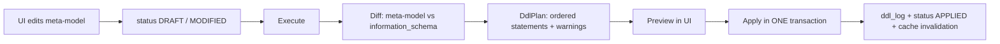

# Rekall - Design Document

Status: draft for review
Date: 2026-08-10

Rekall is a local-first application that stores the structure and the working context of
the projects and tasks you work on, and exposes them read-only to Claude Code over MCP.

It replaces a folder tree of markdown files (`ESA/<project>/issues/<task>/*.md`) with a
relational model whose schema is itself defined at runtime through a UI.

---

## 1. Problem

Current setup: one folder per project, one subfolder per issue, markdown files inside.
It works because Claude Code can read files, but:

- No structure. Relationships between a task, its environment, its cluster, its repos exist
  only as prose repeated in every `CONTEXT.md`.
- No querying. "Which tasks are open on STVV" requires reading every folder.
- Duplication. Cluster coordinates and credentials are copied across files and drift.
- Loading a task into context means naming the right files by hand.

Target: ask Claude Code `Continuiamo a lavorare sul progetto STVV nel task code-validator-main-workflow`
and have the full context loaded in one call, including the environment configuration
the task points to.

---

## 2. Decisions

| # | Decision | Rationale |
|---|---|---|
| D1 | Real dynamic tables, not a JSONB document store | Foreign keys are enforced by the database. A task can never reference a deleted environment. On an app whose only job is to be a reliable memory, silent dangling references are the failure mode that matters. |
| D2 | Claude is read-only | Schema definition, DDL execution and data entry happen exclusively through the UI. The MCP connection uses a Postgres role with `SELECT` only. Not an application-level check: the database refuses. |
| D3 | Markdown content lives in Postgres | `documents` is the source of truth. Full-text search, single backup target, reachable through MCP. Export to a folder tree is a command, not a sync. |
| D4 | Two Postgres schemas, two owners | `rekall_meta` is owned by Liquibase and JPA. `rekall_data` is owned by the jOOQ DDL engine. Liquibase never touches `rekall_data` except to create it. |
| D5 | Modular monolith, single process | Single user, localhost, one database. Maven modules give separation of concerns without distribution. |
| D6 | v1 meta-model covers entities, fields, and relations only | No user-configurable unique constraints, indexes, check constraints, inheritance or computed fields. These are additive later and each one widens the diff engine disproportionately. |
| D7 | Schema changes follow plan / preview / apply | Meta edits accumulate as `DRAFT`. Execute computes a diff against the physical schema, renders the DDL for review, then applies it inside a single transaction. |
| D8 | One retrieval tool, entered by slash command | A session begins with `/rk project:stvv task:code-validator`, not with a question. Reaching a record through a natural-language query costs several turns and a few thousand tokens before any work starts, and it is the part that fails when the model guesses the wrong entity. An explicit anchor removes both. `rekall_query`, `rekall_get` and `rekall_search` were deleted rather than kept as alternatives: a second way in is a second thing to get wrong. |

Non-goals for v1: multi-user, authentication, remote deployment, vector search,
schema import from an existing database, undo of applied DDL.

---

## 3. Module structure

```
rekall/
  rekall-meta/      JPA entities of the meta-model, Liquibase changelogs, repositories
  rekall-engine/    jOOQ. Type mapper, DDL planner, DDL executor, dynamic record repository
  rekall-content/   documents: storage, full-text search, folder importer and exporter
  rekall-api/       REST controllers for the UI
  rekall-mcp/       MCP server, read-only tools
  rekall-app/       Spring Boot entry point, configuration, serves the built frontend
  rekall-ui/        Vue 3 + Vite (built into rekall-app/src/main/resources/static)
```

Dependency direction is strictly downward: `api` and `mcp` depend on `engine` and `content`,
`engine` depends on `meta`, `meta` depends on nothing.

`rekall-mcp` must not depend on `rekall-api`. The two are independent consumers of the same
services, which is what keeps the read-only guarantee structural rather than accidental.

### Stack

| Component | Choice | Note |
|---|---|---|
| Runtime | Java 21 | |
| Framework | Spring Boot 4.1 | |
| Meta persistence | Spring Data JPA | Fixed schema, ordinary entities |
| Dynamic persistence | jOOQ (Open Source Edition) | Full Postgres support, no licence cost |
| Migrations | Liquibase | `rekall_meta` only |
| Database | PostgreSQL 16+ | Transactional DDL is required by D7 |
| MCP server | Spring AI MCP server starter | Version compatibility with Spring Boot 4.1 must be verified in phase 4; fallback is the plain MCP Java SDK behind a Spring `@RestController` |
| Frontend | Vue 3 + Vite | |
| Tests | JUnit 5 + Testcontainers | The DDL engine cannot be meaningfully tested against H2 |

---

## 4. Database layout

```
postgres database: rekall

  schema rekall_meta      owner: rekall_app       Liquibase-managed
    meta_table
    meta_field
    meta_relation
    ddl_log
    document

  schema rekall_data      owner: rekall_app       jOOQ-managed at runtime
    <generated tables>

  role rekall_app         full DML+DDL, used by the application
  role rekall_reader      SELECT on rekall_data and on rekall_meta, used by the MCP server
```

`rekall_reader` is granted `SELECT` on future tables too:

```sql
ALTER DEFAULT PRIVILEGES FOR ROLE rekall_app IN SCHEMA rekall_data
  GRANT SELECT ON TABLES TO rekall_reader;
```

Without this every newly generated table would be invisible to the MCP server.

---

## 5. Meta-model

### 5.1 `meta_table`

| Column | Type | Note |
|---|---|---|
| `id` | uuid | |
| `physical_name` | varchar(63) | Validated `^[a-z][a-z0-9_]{0,62}$`, not a Postgres keyword |
| `label` | varchar(120) | Shown in the UI, e.g. `Task` |
| `label_plural` | varchar(120) | e.g. `Tasks` |
| `description` | text NOT NULL | **Goes into Claude's prompt.** Non-empty, validated |
| `aliases` | text[] | Synonyms for semantic matching, e.g. `{progetti, commesse}` |
| `display_field_id` | uuid | FK to `meta_field`. The human-readable identity of a record |
| `status` | enum | `DRAFT`, `APPLIED`, `MODIFIED` |
| `created_at`, `updated_at` | timestamptz | |

`display_field_id` is not cosmetic. It is what makes a resolved reference readable to Claude:
without it a task carries `"environment_id": "7f3a1c2e-..."`, with it `"environment": {"label": "kmaster14 / stvv-dev", ...}`.

### 5.2 `meta_field`

| Column | Type | Note |
|---|---|---|
| `id` | uuid | |
| `meta_table_id` | uuid | FK, `ON DELETE CASCADE` |
| `column_name` | varchar(63) | Same validation as `physical_name` |
| `label` | varchar(120) | |
| `description` | text NOT NULL | Goes into Claude's prompt |
| `type` | enum `MetaFieldType` | See 5.4 |
| `nullable` | boolean | |
| `default_value` | text | Rendered as a literal, never as raw SQL |
| `length` | int | `TEXT` only |
| `precision`, `scale` | int | `DECIMAL` only |
| `enum_values` | text[] | `ENUM` only |
| `position` | int | Column and form ordering |

### 5.3 `meta_relation`

| Column | Type | Note |
|---|---|---|
| `id` | uuid | |
| `source_table_id` | uuid | |
| `target_table_id` | uuid | |
| `kind` | enum | `MANY_TO_ONE`, `MANY_TO_MANY` |
| `source_field_id` | uuid | The `REFERENCE` field holding the FK. `MANY_TO_ONE` only |
| `join_table_name` | varchar(63) | `MANY_TO_MANY` only |
| `on_delete` | enum | `RESTRICT`, `CASCADE`, `SET_NULL` |
| `description` | text NOT NULL | e.g. "The environment this task runs on" |

`ONE_TO_MANY` is not stored. It is the inverse view of a `MANY_TO_ONE` and is derived when
rendering the schema, otherwise you get two rows that can disagree.

### 5.4 Type mapping

Users pick from a closed enum. Raw SQL types never reach the engine.

| `MetaFieldType` | Postgres | Note |
|---|---|---|
| `TEXT` | `varchar(n)` | `n` from `length`, default 255 |
| `LONG_TEXT` | `text` | |
| `MARKDOWN` | `text` | Same storage as `LONG_TEXT`, different UI editor |
| `INTEGER` | `bigint` | Always 64-bit, removes a whole class of migrations |
| `DECIMAL` | `numeric(p,s)` | |
| `BOOLEAN` | `boolean` | |
| `DATE` | `date` | |
| `TIMESTAMP` | `timestamptz` | |
| `ENUM` | `varchar(n)` + generated `CHECK (col IN (...))` | The check is derived from `enum_values`, not user-authored. Consistent with D6 |
| `TAGS` | `text[]` + GIN index | |
| `REFERENCE` | `uuid` + FK | Paired with a `meta_relation` |

### 5.5 System columns

Every generated table gets these, and they are not represented in `meta_field`:

```sql
id         uuid        PRIMARY KEY DEFAULT gen_random_uuid()
created_at timestamptz NOT NULL DEFAULT now()
updated_at timestamptz NOT NULL DEFAULT now()
```

`updated_at` is maintained by a trigger installed once per generated table.

### 5.6 Many-to-many

Generated as `rel_<source>_<target>`:

```sql
CREATE TABLE rekall_data.rel_task_tag (
  task_id uuid NOT NULL REFERENCES rekall_data.task(id) ON DELETE CASCADE,
  tag_id  uuid NOT NULL REFERENCES rekall_data.tag(id)  ON DELETE CASCADE,
  PRIMARY KEY (task_id, tag_id)
);
```

### 5.7 `ddl_log`

| Column | Note |
|---|---|
| `id`, `sequence` | Ordering is what makes replay possible |
| `statement` | Rendered inlined SQL |
| `plan_id` | Groups the statements of one Execute |
| `applied_at`, `status`, `error` | |

`rekall_data` has no Liquibase changelog by construction. `ddl_log` is what replaces it:
it is the audit trail and the recipe to rebuild the schema from an empty database.

---

## 6. DDL engine

### 6.1 Flow



The physical side of the diff is read through jOOQ's `dsl.meta()`, never from a cached
assumption of what was created. If someone changed the schema by hand, the diff sees it.

### 6.2 Statement ordering

1. `CREATE TABLE` for every new entity, without foreign keys
2. `ADD COLUMN` / `ALTER COLUMN` / `DROP COLUMN`
3. `ADD CONSTRAINT ... FOREIGN KEY` for every new relation
4. Join tables for many-to-many
5. `DROP CONSTRAINT` then `DROP TABLE` for removals

Deferring all foreign keys to step 3 removes any dependency on creation order, including
circular references between two new entities.

### 6.3 Alter rules

The planner classifies every change as `SAFE`, `NEEDS_INPUT` or `BLOCKED`.

| Change | Class | Behaviour |
|---|---|---|
| New nullable column | SAFE | |
| New `NOT NULL` column, table empty | SAFE | |
| New `NOT NULL` column, table has rows | NEEDS_INPUT | UI asks for a default, plan becomes `ADD` nullable, `UPDATE` backfill, `SET NOT NULL` |
| `varchar(n)` widening, `numeric` scale increase | SAFE | |
| Any other type change | BLOCKED | Delete the field and create a new one, migrate content manually |
| Drop column | NEEDS_INPUT | Explicit confirmation, affected row count shown |
| Drop table referenced by a FK | BLOCKED | UI lists the dependent entities |
| Rename table or column | NOT SUPPORTED | See below |
| Relation `ON DELETE` change | SAFE | `DROP CONSTRAINT` + `ADD CONSTRAINT` |

Renaming was in the original plan and was dropped during implementation. A diff between the
meta-model and `information_schema` cannot distinguish a rename from a drop plus an add, so
supporting it would require storing the previous physical name and trusting it. Getting that
wrong destroys a column. Instead, `physical_name` and `column_name` are immutable, and `label`
is freely editable: the user-visible name can change, the identifier cannot.

Removing an enum value while rows still use it is `BLOCKED`.

### 6.4 Identifier safety

Two independent layers:

1. Validation on write to `meta_table` / `meta_field`: regex plus a Postgres reserved-word
   blacklist, applied before anything is persisted.
2. Rendering: every identifier goes through `DSL.name(...)` with
   `Settings().withRenderQuotedNames(RenderQuotedNames.ALWAYS)`.

String concatenation into DDL is never acceptable, including in tests.

### 6.5 Schema cache

The engine keeps an in-memory `SchemaRegistry` of the applied meta-model, so that a query
does not hit `rekall_meta` for every field lookup. It is invalidated at the end of a
successful apply. It is deliberately not a Spring `@Cacheable`: invalidation is a single
explicit call at one known point.

---

## 7. Dynamic data access

```java
public interface DynamicRecordRepository {
    UUID insert(MetaTable table, Map<String, Object> values);
    void update(MetaTable table, UUID id, Map<String, Object> values);
    void delete(MetaTable table, UUID id);
    Optional<RecordView> findById(MetaTable table, UUID id, int resolveDepth);
    List<RecordView> query(MetaTable table, QueryFilter filter);
    long count(MetaTable table, QueryFilter filter);
}
```

No code generation, no compiled jOOQ constants: fields are built as
`DSL.field(DSL.name(columnName), dataType)` from the registry, which is what allows the
schema to change without a rebuild.

### 7.1 Query filter

```java
record QueryFilter(List<Condition> conditions, List<Sort> sort, int limit, int offset) {}
record Condition(String field, Operator op, Object value) {}

enum Operator { EQ, NEQ, GT, GTE, LT, LTE, LIKE, ILIKE, IN, IS_NULL, IS_NOT_NULL, CONTAINS }
```

Conditions are AND-combined in v1. `CONTAINS` applies to `TAGS`. Values are always bound as
parameters, never inlined.

### 7.2 Reference resolution

`resolveDepth = 0` returns raw uuids. `resolveDepth = 1`, the default for MCP reads, joins
each `MANY_TO_ONE` target and inlines the full target record:

```json
{
  "id": "…",
  "name": "code-validator-main-workflow",
  "status": "in_progress",
  "environment": {
    "id": "…",
    "_label": "kmaster14 / stvv-dev",
    "kubeconfig_path": "/Users/valeriomc/Projects/ESA/_kmasters/config.kmaster14",
    "namespace": "stvv-dev"
  }
}
```

`_label` is computed from `display_field_id`. Depth is capped at 2 to avoid unbounded
expansion through a chain of references.

---

## 8. Documents

```sql
CREATE TABLE rekall_meta.document (
  id            uuid PRIMARY KEY,
  entity_name   varchar(63) NOT NULL,
  record_id     uuid NOT NULL,
  title         varchar(255) NOT NULL,
  kind          varchar(40) NOT NULL,      -- context | notes | architecture | report | other
  body_markdown text NOT NULL,
  source_path   text,                      -- provenance if imported, never a source of truth
  position      int NOT NULL,
  search_vector tsvector GENERATED ALWAYS AS (to_tsvector('simple', title || ' ' || body_markdown)) STORED,
  created_at    timestamptz NOT NULL,
  updated_at    timestamptz NOT NULL
);
CREATE INDEX idx_document_record ON rekall_meta.document (entity_name, record_id);
CREATE INDEX idx_document_search ON rekall_meta.document USING GIN (search_vector);
```

`(entity_name, record_id)` is a soft reference, not a foreign key: it points into
`rekall_data` whose tables do not exist at migration time. Consequence: dropping an entity
must also delete its documents, and that cleanup belongs in the DDL apply step.
`to_tsvector('simple', …)` avoids committing to a language stemmer on content that mixes
Italian and English.

Two commands, both one-directional and explicit:

- **Import**: walks a folder tree, creates records and attaches the markdown. Used once to
  ingest the existing `ESA/` tree.
- **Export**: writes `<entity>/<record-label>/<document-title>.md`. A backup and an escape
  hatch, not a sync. There is no file watcher.

---

## 9. REST API

Used only by the UI. Split by concern so that the read-only boundary stays visible.

```
GET    /api/meta/tables
POST   /api/meta/tables
PUT    /api/meta/tables/{id}
DELETE /api/meta/tables/{id}
POST   /api/meta/tables/{id}/fields
POST   /api/meta/relations

GET    /api/meta/plan              -> the DdlPlan, statements and warnings, no side effect
POST   /api/meta/apply             -> executes the plan, returns the ddl_log entries

GET    /api/data/{entity}
POST   /api/data/{entity}
GET    /api/data/{entity}/{id}
PUT    /api/data/{entity}/{id}
DELETE /api/data/{entity}/{id}

GET    /api/documents?entity=&recordId=
POST   /api/documents
PUT    /api/documents/{id}
DELETE /api/documents/{id}
```

---

## 10. MCP server

The point of the whole design. Two tools, both generic over the meta-model, so they keep
working whatever entities are defined. There is no NLU layer in Rekall and, since D8, no
tool that tries to be one.

Transport: HTTP on the same process as the UI.

```bash
claude mcp add --transport http rekall http://localhost:8080/mcp
```

### 10.1 `rekall_schema`

No arguments. Returns the whole meta-model as compact markdown. It says which anchors exist,
which is the one thing `rekall_context` cannot answer for itself.

```
## Project  (projects, progetti, commesse)
Tutti i progetti su cui si sta lavorando.
- name (TEXT, required) - Nome breve del progetto
- status (ENUM: active|paused|done) - Stato corrente
- description (LONG_TEXT) - Cosa fa il progetto

## Task  (tasks, issues, attivita)
Attivita e issue legate a un progetto. Ogni task ha documenti di contesto allegati.
- name (TEXT, required) - Identificativo del task
- status (ENUM: todo|in_progress|blocked|done)
- project -> Project (many-to-one) - Il progetto a cui appartiene
- environment -> Environment (many-to-one) - L'ambiente su cui gira

## Environment  (environments, ambienti)
Configurazioni di cluster, namespace e database.
- label (TEXT, required) - Nome leggibile dell'ambiente
- namespace (TEXT) - Namespace Kubernetes
- kubeconfig_path (TEXT) - Percorso locale del kubeconfig
```

### 10.2 `rekall_context`

The only retrieval tool. A session starts with a slash command, not with a question:

```
/rk project:stvv task:code-validator-main-workflow
```

```json
{ "anchors": "project:stvv task:code-validator-main-workflow" }
```

An **anchor** is `entity:value`. The entity part is matched against the physical name, the
label, the plural label and the aliases, case-insensitively; the value against the entity's
display field. A value containing spaces is quoted: `environment:"kmaster14 / stvv-dev"`.

A bare term with no `entity:` is looked up across every entity and accepted only when exactly
one record matches, which is what makes the short form work:

```
/rk stvv code-validator-main-workflow
```

On more than one match the candidates are returned with their entity and nothing is loaded.
The tool does not score, weigh or choose.

For each anchor the response carries, in order:

1. the record, with its fields
2. its forward `MANY_TO_ONE` references resolved in full, at depth 1
3. the records referencing it, as labels only, printed as anchors that can be passed straight
   back. This is where "the tasks of a project" comes from: it is the generic inverse relation,
   not a special case
4. every markdown document attached to it, in full

Everything above is derived from the meta-model. The word "project" does not appear in the
module, and neither does any configuration naming an entity.

### 10.3 Guarantees

- Every tool is read-only. The MCP datasource authenticates as `rekall_reader`.
- Tool responses are capped in size, with an explicit truncation notice rather than a
  silent cut.
- `rekall-mcp` has no compile-time access to any write path.

---

## 11. Frontend

Vue 3 + Vite, three areas:

1. **Schema designer.** List of entities, field editor, relation editor. Execute opens the
   plan preview with the generated SQL and its warnings, colour-coded by
   `SAFE` / `NEEDS_INPUT` / `BLOCKED`. Apply is disabled while any change is `BLOCKED`.
2. **Data browser.** Table view per entity, form generated from `meta_field`, reference
   fields as searchable selects showing the display field.
3. **Document editor.** Markdown editor with preview, attached to a record.

A visual relation canvas (Vue Flow) is explicitly out of the v1 scope. It is the single
most expensive piece of UI in this project and adds no capability that the relation editor
does not already provide.

---

## 12. Roadmap

| Phase | Deliverable | Done when |
|---|---|---|
| 0 | Maven skeleton, Spring Boot 4.1, Postgres, Liquibase on `rekall_meta`, JPA meta-model, both roles | `docker compose up` plus app start creates both schemas |
| 1 | Type mapper, diff engine, `DdlPlan`, transactional apply, `ddl_log` | Testcontainers suite covering every row of the 6.3 alter table |
| 2 | `DynamicRecordRepository`, filters, reference resolution, `document` | Projects, Tasks, Environment created and populated from tests |
| 3 | REST API and UI: schema designer, data browser, document editor | The `ESA/stvv` structure is reproducible entirely through the UI |
| 4 | **MCP server, `rekall_context` and `rekall_schema`** | `/rk project:stvv task:code-validator-main-workflow` loads the full context in one call |
| 5 | Folder importer for the existing `ESA/` tree | `stvv` and `ainabler` fully ingested |
| 6 | Export command, relation canvas | |

Phase 4 is the point where the application stops being an exercise and starts replacing the
folders. Everything before it is a means to that end, and nothing optional should be pulled
in front of it.

---

## 13. Implementation notes

Things that were unknown when this document was written and are now settled.

| Topic | Outcome |
|---|---|
| MCP server library | Hand-rolled. MCP over HTTP is three JSON-RPC methods and one POST endpoint, so `McpController` owns it outright rather than tracking a library's compatibility with a very new Spring Boot. |
| Spring Boot 4 auto-configuration | Split into per-technology modules. `liquibase-core` on the classpath no longer triggers anything: `spring-boot-liquibase` is what registers it. The same restructuring moved `EntityScan` to `org.springframework.boot.persistence.autoconfigure`. |
| Jackson | Spring Boot 4.1 ships Jackson 3, whose base package is `tools.jackson.databind`. Annotations stayed at `com.fasterxml.jackson.annotation`. |
| `TestRestTemplate` | Gone from Spring Boot 4. Integration tests use Spring Framework's `RestClient` with status handling disabled so they can assert on codes. |
| Testcontainers | 1.21.4 or newer is required. Earlier versions negotiate Docker API 1.32, which Docker Engine 29 refuses. |
| Two `DataSource` beans | The MCP reader pool is declared with `defaultCandidate = false`. Without it, injection by type is ambiguous and Liquibase can pick up the identity that cannot write. |
| Generated ids over REST | A JPA `save()` on an entity that already has an id goes through `merge()`, which persists a *copy* of any new cascaded child. New fields are persisted directly through their own repository so the instance returned to the controller carries its generated id. |
| Full-text search | PostgreSQL keeps URLs and paths as single tokens, so `/api/v1/pipelines` is not found by searching `pipelines`. Accepted: these notes are searched for cluster names and endpoints far more often than for a word inside a path. |

## 14. Open points

- Secrets stored in records (the GitLab PATs currently sitting in `cluster.md`) are
  plaintext in Postgres. Acceptable for a local single-user database on an encrypted disk,
  but it must be a conscious decision and the README has to say so.
- Backup strategy: `pg_dump` on a schedule versus the export command.
- The relation canvas, `ONE_TO_MANY` navigation from the UI, and pgvector search remain out
  of scope.
